# Social Engineering in Practice Lab: Website Cloning and SMB Vulnerability Scanning

This repository documents how I used:

1. `setoolkit` in my **Website Cloning Lab**
2. `enu4linux` and `smbclient` in my **SMB Vulnerability Scanning Lab**

My objective for these activities is to practice **ethical hacking techniques** in a controlled environment for **learning and security testing purposes only**.

##  Ethical & Legal Disclaimer

All activities documented here were performed:

- In a **controlled lab environment**
- Against **intentionally virtual systems I own and have explicit permission to test**
- Strictly for **educational and training** purposes.

 **Do not** use these techniques on networks or systems without explicit authorization. Unauthorized access or testing is illegal and unethical.

##  Repository Structure

- `README.md` – The documentation
- `screenshots/` – Screenshots of key steps and results.

## Part 1: Website Cloning Lab (SET Toolkit)

###  Objective

Use **Social-Engineer Toolkit (SET)** to clone a target website and capture login credentials, demonstrating:

- Proper use of `setoolkit`
- Understanding how credential harvesting via cloning works
- Awareness of the **ethical context** (for education/testing only)

###  Tools & Environment

- **Kali Linux** (attacker machine)
- **SET (Social-Engineer Toolkit)**
- **DVWA** (`http://dvwa.vm`) as the target web application – intentionally vulnerable virtual web app.
- Browser and text editor (e.g. `firefox`, `pluma`)

### 1.1 High-Level Concept

The idea of this lab is to:

1. Use SET to **clone a legitimate login page**.
2. Host the cloned page on the attacker machine (e.g. `10.6.6.1`).
3. Trick a user into visiting this cloned page.
4. When the user submits their credentials, SET **captures** them and then **redirects** the user back to the original site to avoid suspicion.

Once again, this is only acceptable in a **lab** or with **explicit permission**.

### 1.2 Commands Used (Step-by-Step)

#### Step 1 – Start SET as root
bash `sudo su setoolkit` 
In SET’s menu, follow this sequence:

1. Type `1` – **Social-Engineering Attacks** 
2. Press `Enter` 
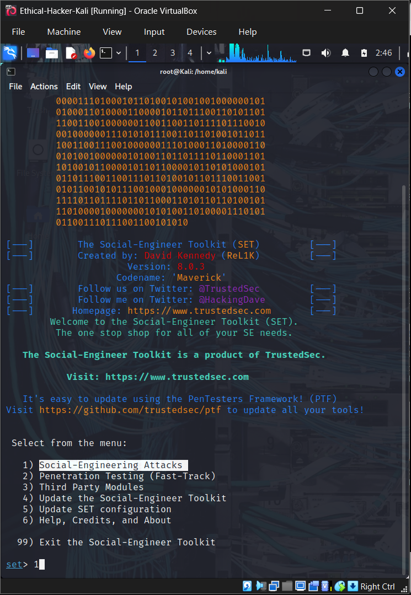

3. Type `2` – **Website Attack Vectors** 
4. Press `Enter` 
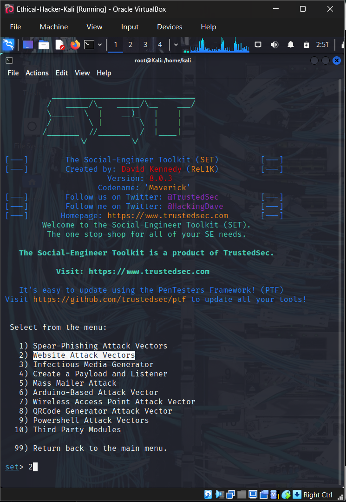

5. Type `3` – **Credential Harvester Attack Method** 
6. Press `Enter` 

7. Type `2` – **Site Cloner** 
8. Press `Enter`
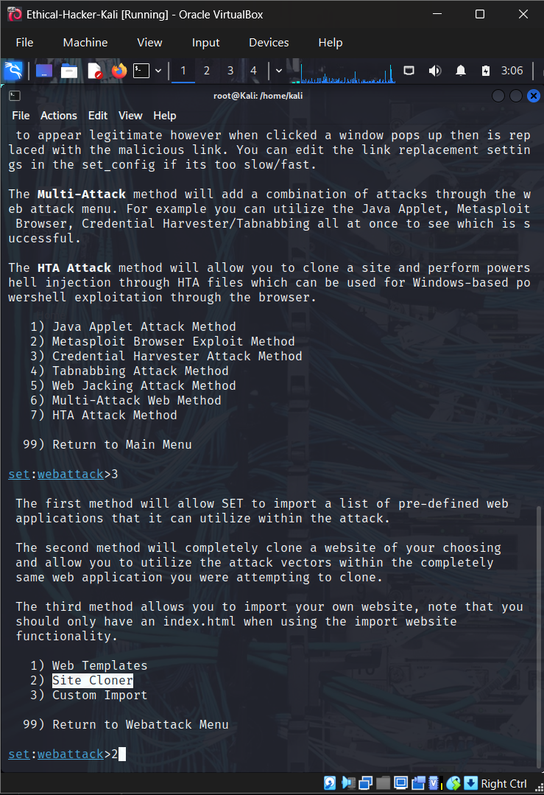

#### Step 2 – Configure the phishing server

When prompted:

- For **IP address for the POST back in Harvester/Tabnabbing**:
text 10.6.6.1 
- For **URL to clone**:
text http://dvwa.vm 
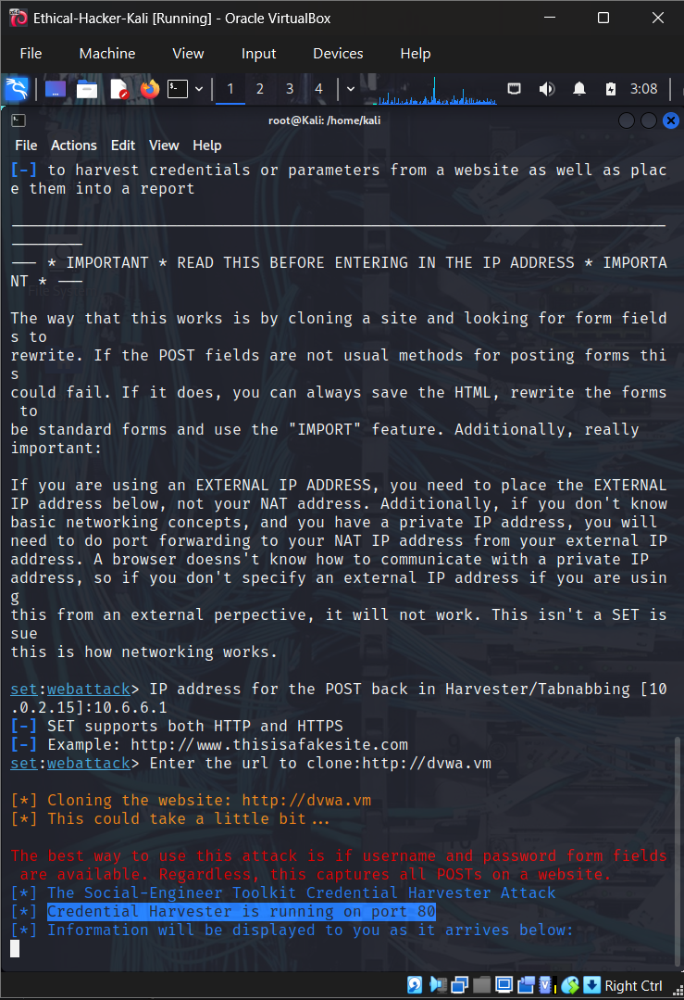
SET now cloned the DVWA login page and started a web server on `10.6.6.1`, listening for captured credentials.

### 1.3 Creating the Redirect HTML Page

To simulate a phishing scenario, we create a local HTML file that **immediately redirects** the browser to the attacker’s cloned page.

1. Opened a text editor and crafted the redirect HTML page:
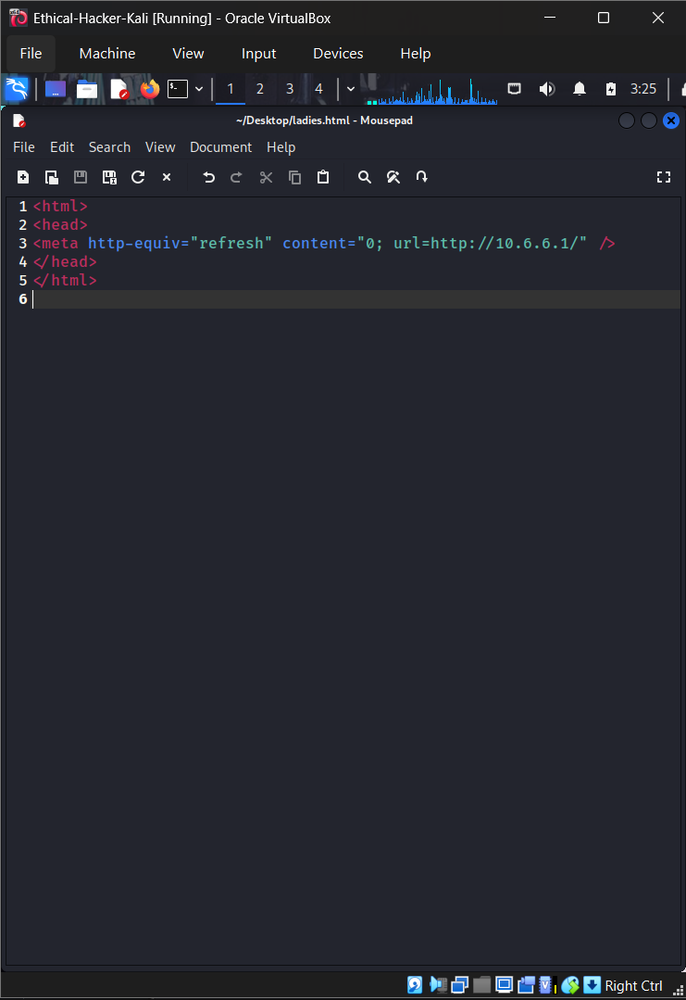
2. Save the file as `ladies.html` on the **Desktop**.

3. Double-click `ladies.html` to open it in a browser. 
The browser instantly redirected to `http://10.6.6.1/` (the cloned DVWA page).

### 1.4 Testing Credential Capture

On the cloned page:

- Entered the following test credentials:
text Email/Username: ladies@gmail.com Password: cisco1234 
- Clicked **Login**.
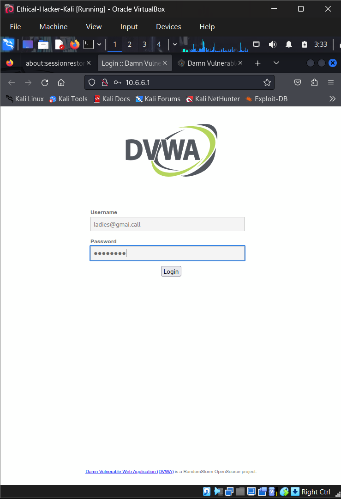

On the SET terminal window, credentials were captured in the background.
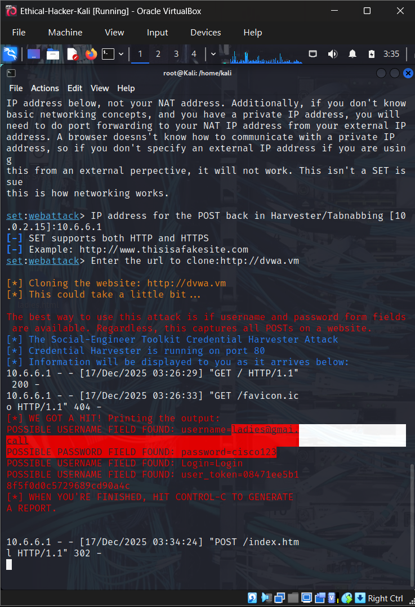

### 1.5 Stopping SET and Viewing the Report

1. Got back to the terminal where SET was running.
2. Pressed `Ctrl + C` to stop the current SET attack.
3. Exit the menus by typing `99` multiple times until I fully quit SET.
4. Viewed the SET report:
bash$ `cat /root/.set/reports/"2025-12-14 13:34:09.326665.xml"`
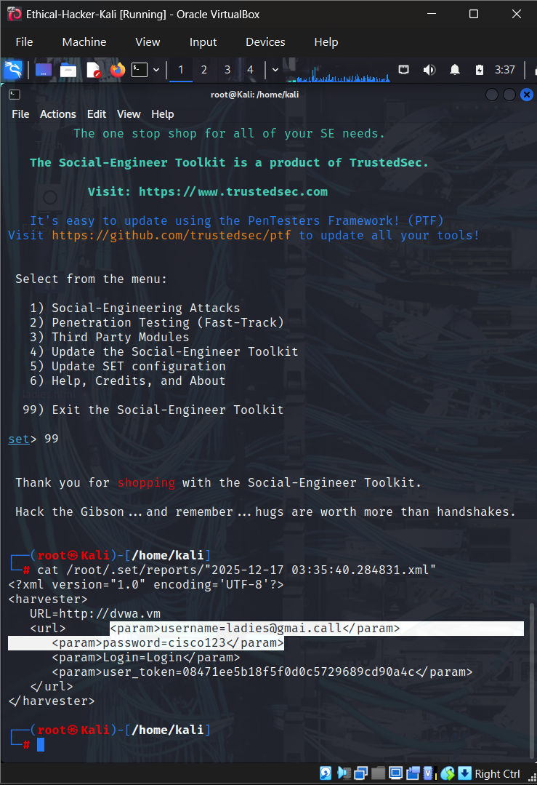

This is the XML file that contains the captured credentials, including the username `ladies@gmail.com` and password `cisco1234`.

### 1.6 What I Learned (Website Cloning)

- How to use **SET** for:
- Social-engineering attacks
- Website cloning
- Credential harvesting
- The importance of **HTTPS**, browser security indicators, and user awareness in defending against phishing.
- Why **authorization and consent** are critical: the exact same technique, if used without permission, becomes a serious cybercrime.

## Part 2: SMB Vulnerability Scanning (enum4linux & smbclient)

###  Objective

Use **enum4linux** and **smbclient** to:

- Discover and enumerate an SMB service
- Identify users, shares, and possible misconfigurations
- Understand how attackers gather information during the **reconnaissance** phase

###  Tools & Environment

- **Kali Linux** (attacker machine)
- Target machine with **SMB** service running at `172.17.0.2`
- Tools:
- `enum4linux`
- `nmap`
- `smbclient`

### 2.1 Target Discovery

First, verified that the target is reachable and identify live hosts.
bash$ `sudo su nmap -sN 172.17.0.0/24` 
- `-sN` runs a **TCP Null scan**, which can help identify live hosts and firewall behaviors.

From the scan, the target host is identified at: `172.17.0.2` 
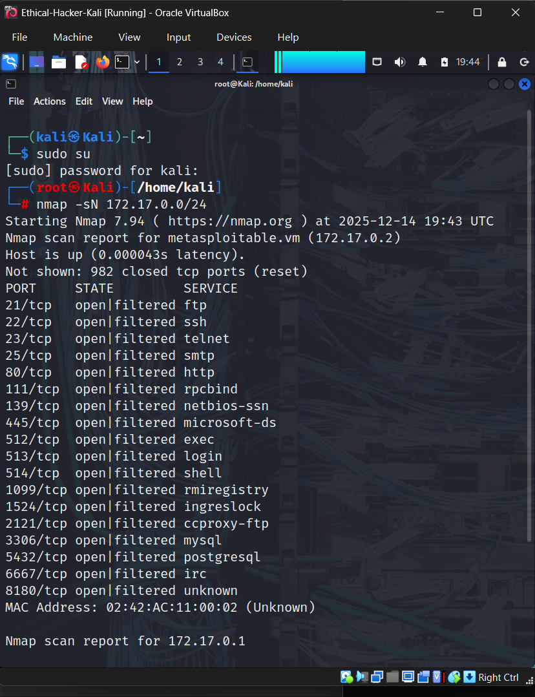

### 2.2 Enum4linux – Help and Basic Usage

Checked available options:
bash$ `enum4linux -help` 
This displayed different switches we can use to enumerate users, shares, policies, and other SMB-related information.

### 2.3 Enum4linux Scanning Commands

Ran a series of focused scans against `172.17.0.2`:
bash$ `enum4linux -U 172.17.0.2` # Enumerate users, `enum4linux -n 172.17.0.2` # Do not resolve hostnames, `enum4linux -o 172.17.0.2` # OS information, `enum4linux -S 172.17.0.2` # Enumerate shares, `enum4linux -Sv 172.17.0.2` # Verbose share enumeration, `enum4linux -P 172.17.0.2` # Password policy information, `enum4linux -a 172.17.0.2` # All-in-one comprehensive scan.
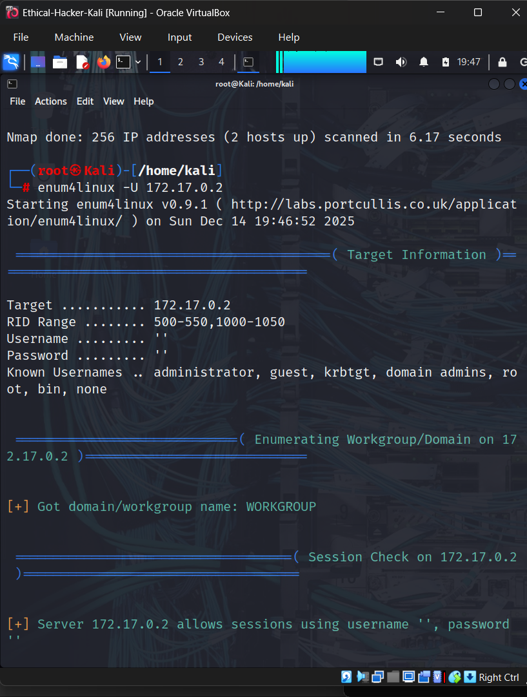

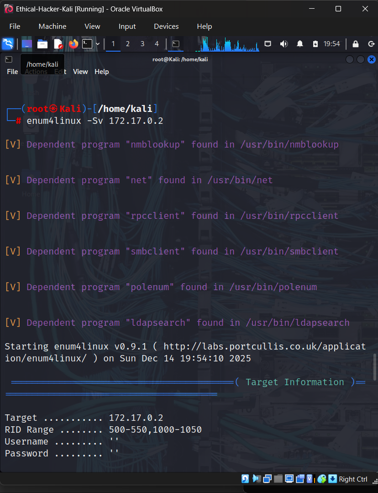
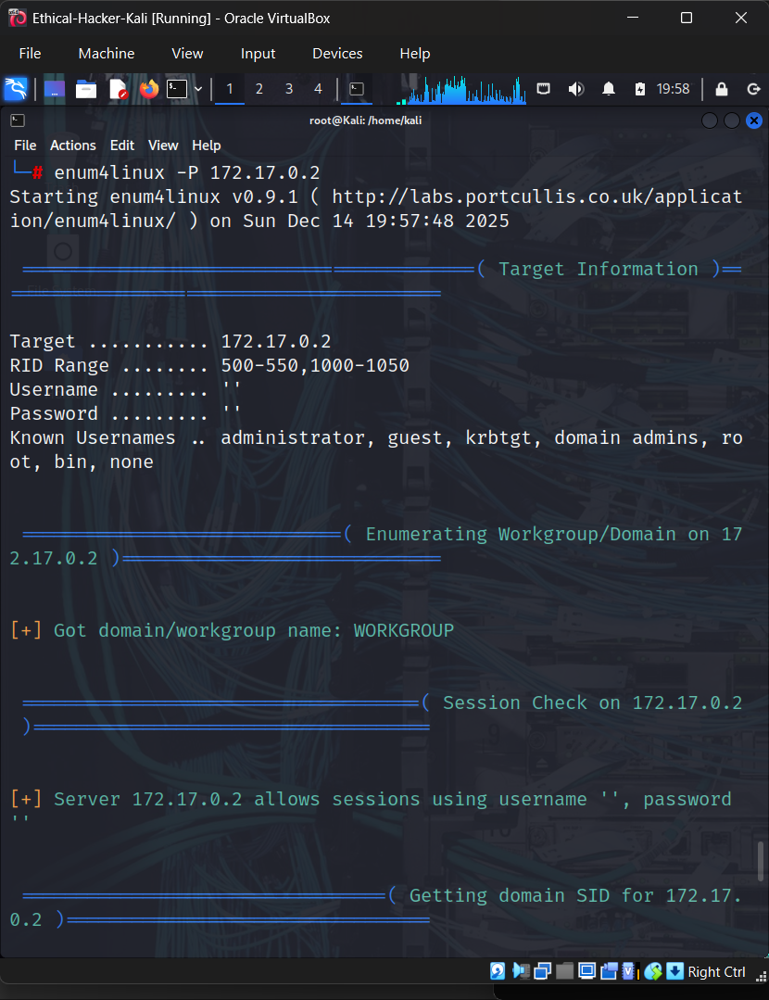
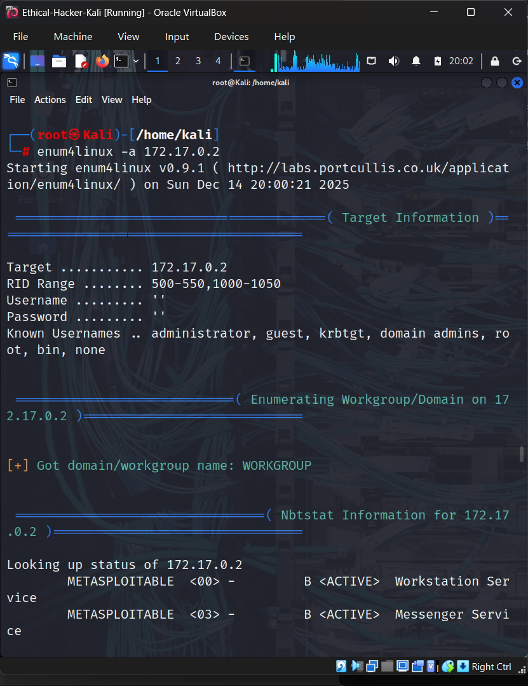

### 2.4 Exploring SMB with smbclient

Checked the help menu:
bash$ `smbclient --help` 
Then, listed the available shares on the target:
bash$ `smbclient -L //172.17.0.2/` 
Anonymous access or guest access is allowed, so the shares are still listed even with a blank password.
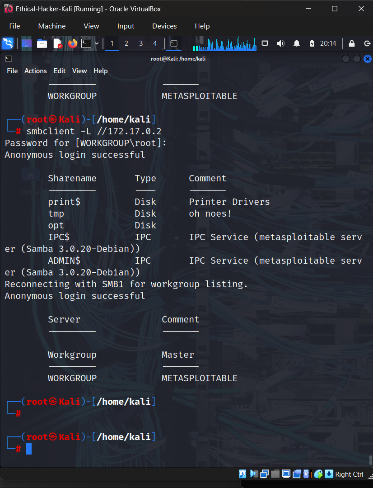

Connected to specific shares:
bash$ `smbclient //172.17.0.2/tmp` 
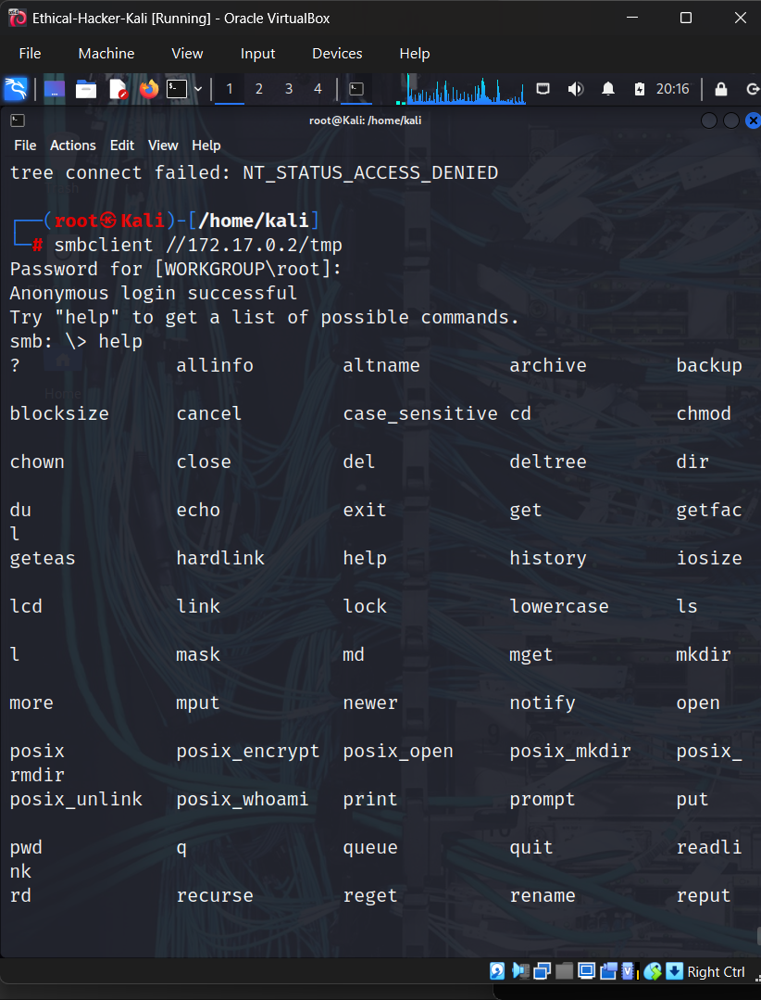
bash$ `smbclient //172.17.0.2/tmp` 
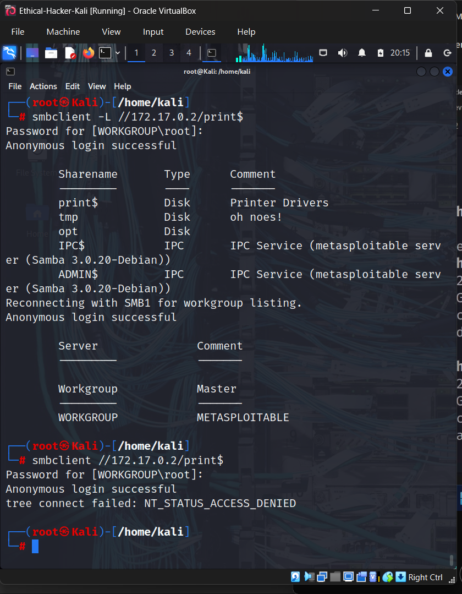

### 2.5 Creating and Uploading a Test File

Opened a **new terminal** (still on the attacker machine):

1. Created a test file pretending to be `virus.exe`:
bash# `nano virus.exe` 
2. Typed dummy text inside: sdsferfhrt hfsa efs 
3. Saved and exit:
4. Confirmed file creation:
bash$ `ls cat virus.exe` 
Then returned to the **original terminal** where `smbclient` is connected to `//172.17.0.2/tmp`.

Uploaded the file to the share and renamed it on upload:
Bash$ `put virus.exe group_work.txt dir quit` 

### 2.6 What I Learned (SMB Scanning)

- How **enum4linux** automates SMB enumeration:
- User enumeration
- Share discovery
- OS and password policy information
- How **smbclient** can be used to:
- List available SMB shares
- Connect to a share
- Upload and download files

- The security implications:
- Misconfigured shares with **anonymous access** can allow file upload or data theft.
- Weak or missing password policies make brute-force or credential stuffing easier.
- Proper hardening (restricting shares, enforcing strong authentication, and monitoring logs) is critical to defend against such attacks.

##  Overall Skills Gained

Across both labs, I practiced:

- **Social engineering simulation** using website cloning and credential harvesting
- **Network and service reconnaissance** using `nmap`
- **Service enumeration** for SMB using `enum4linux`
- **Interacting with SMB shares** via `smbclient`
- Writing **clear, step-by-step documentation** and maintaining a **GitHub repository** with:
- Commands used
- Explanations in my own words
- Screenshots as evidence of execution
