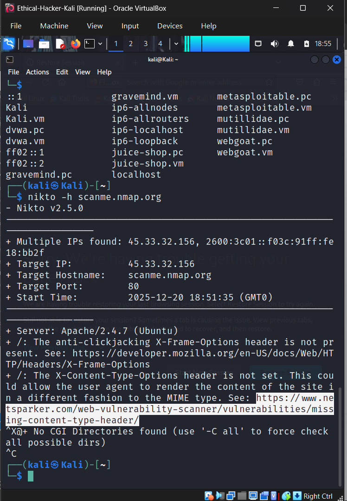
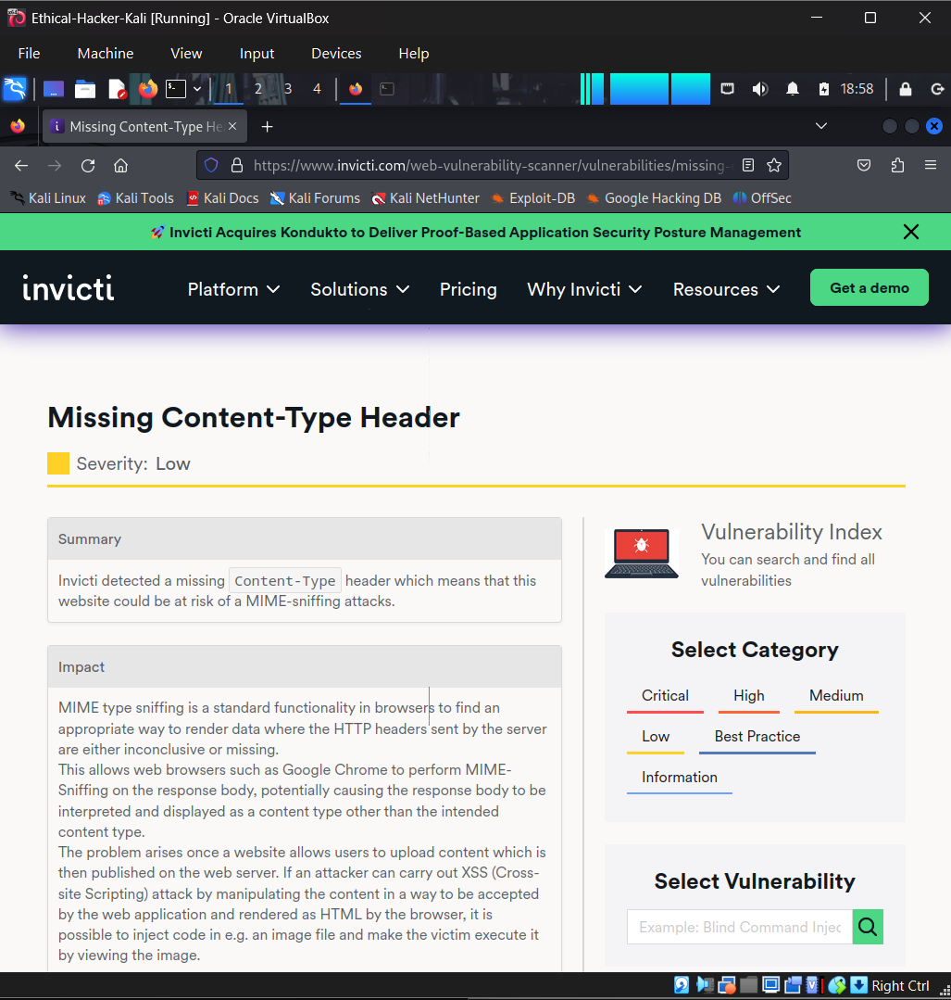
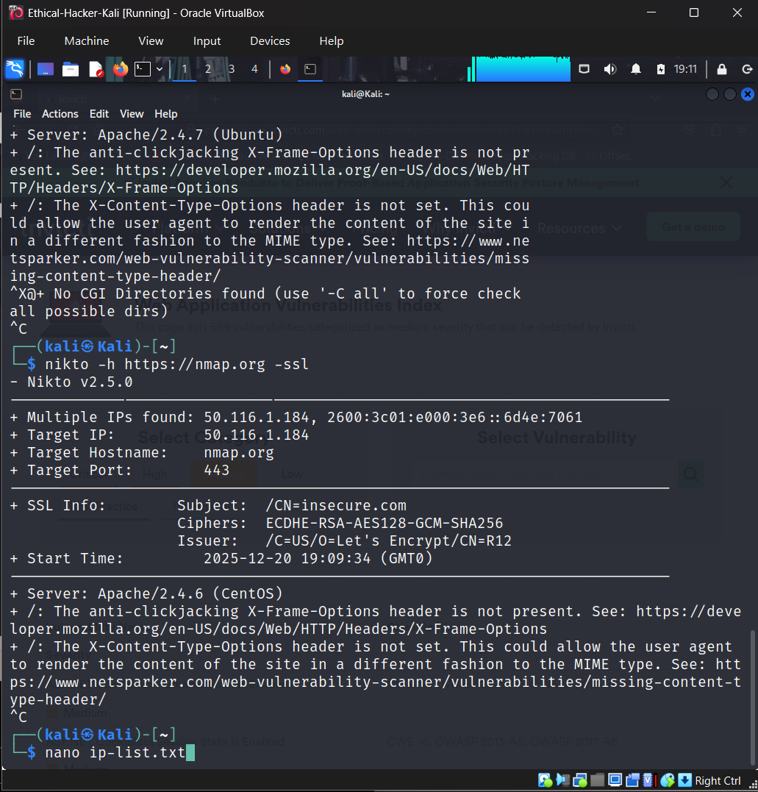
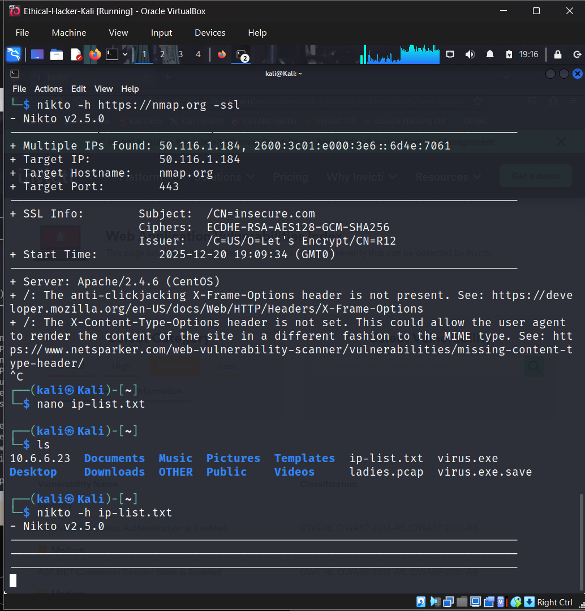
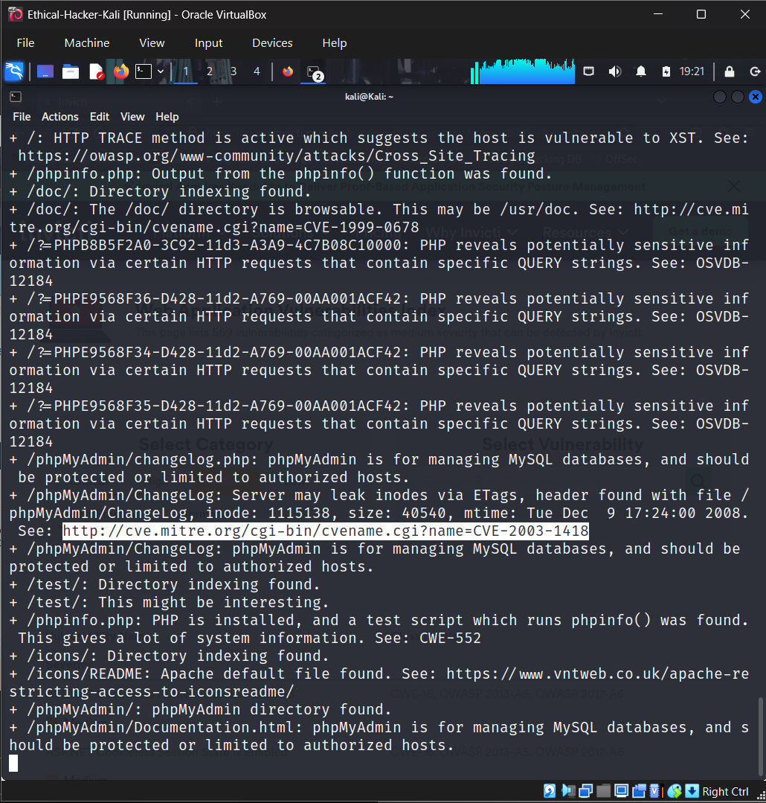
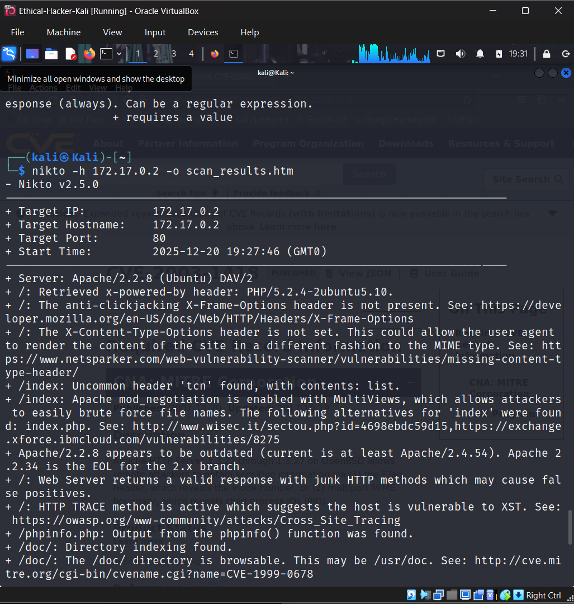
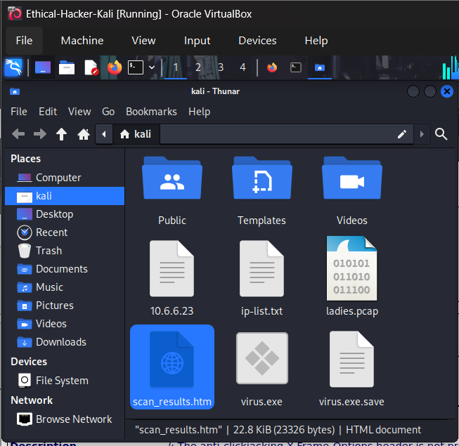

# Vulnerability Scanning Lab: Nikto

## 1. Objective
The purpose of this lab was to utilize **Nikto**, an Open Source (GPL) web server scanner, to execute extensive testing against web servers for multiple items.

## 2. Tools Used
* **Kali Linux Ethical Hacker VM** (Virtual Environment)
* **Nikto v2.5.0**
* **Invicti/CVE Databases** (For vulnerability research)
* **Nano Text Editor** (Used to list targeted IPs)

## 3. Lab Process & Commands

### Step 1: Basic HTTP Scan
I started by conducting a basic scan against `scanme.nmap.org` to find standard misconfigurations on port 80.

**Command:**
```bash
nikto -h scanme.nmap.org
```
Observations:
The scan identified several missing security headers. 
Specifically;
- the X-Frame-Options is not present.
- and the X-Content-Type-Options headers too are not set. Which could allow the user agent to render the content of the site in a different fashion to the MIME type.


Step 2: Vulnerability Research
Nikto provided references to specific vulnerabilities (OSVDB/CVE). I followed the provided links to understand the "Missing Content-Type Header" vulnerability.


Step 3: SSL/HTTPS Scanning
Next, I performed an SSL-enabled scan against nmap.org to test port 443 and check SSL certificate information.
Command:
```Bash
nikto -h https://nmap.org -ssl
```


Step 4: Scanning Multiple Targets from a File
To automate the process for multiple targets, I created a text file containing a list of IP addresses (10.6.6.11, 10.6.6.13, 10.6.6.14, 10.6.6.23, and 172.17.0.2) named ‘ip-list.txt using the nano text editor, and fed this file into Nikto.
Command:
```Bash
nano ip-list.txt
```

# (Added IPs to file)
# Ran Nikto Scans Against the listed Targets.
```Bash
nikto -h ip-list.txt
```



Step 5: Exporting Reports & Deep Analysis
I targeted this specific local host (172.17.0.2) and exported the results to an HTML file for better readability and documentation.
Command:
```Bash
nikto -h 172.17.0.2 -o scan_results.htm
```
I located the file in the directory and opened it in a browser to view the structured report.



4. Findings & Analysis
During the scan of 172.17.0.2, critical information disclosures were discovered:
Outdated Server: Apache 2.2.8 is running, which is outdated.
PHP Info Leak: The /phpinfo.php file was found, which leaks sensitive system information.
Directory Traversal/Browsing: The /doc/ directory is browsable.
CVE-2003-1418: An Apache information leak allowing remote attackers to obtain sensitive information via ETag headers.


5. Conclusion
Through this lab, I discovered and demonstrated the importance of disabling unnecessary features (like directory indexing), hiding server version banners, and keeping software patched and updated. Tools like Nikto are essential for identifying these "low-hanging fruit" vulnerabilities before attackers do.
