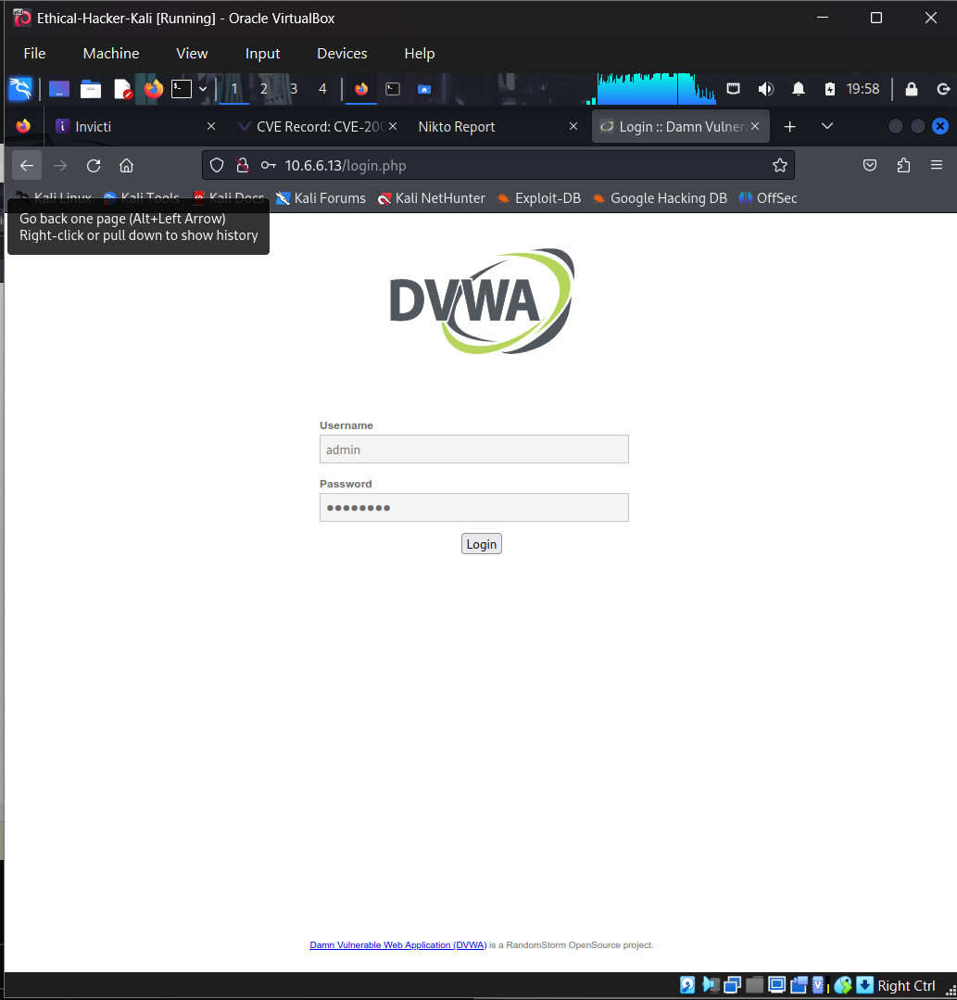
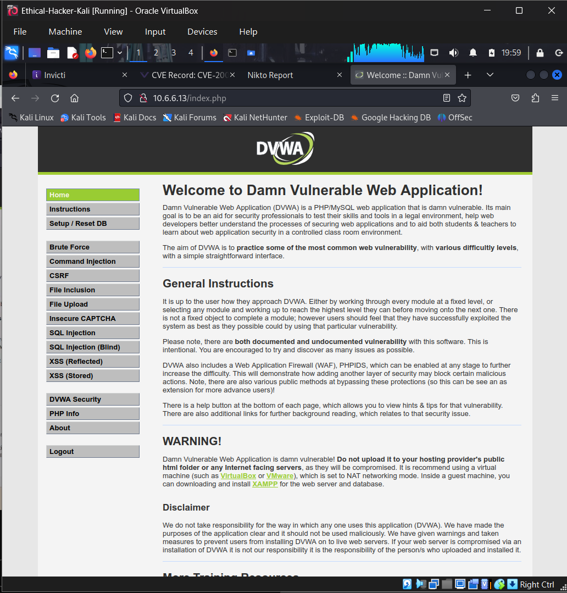
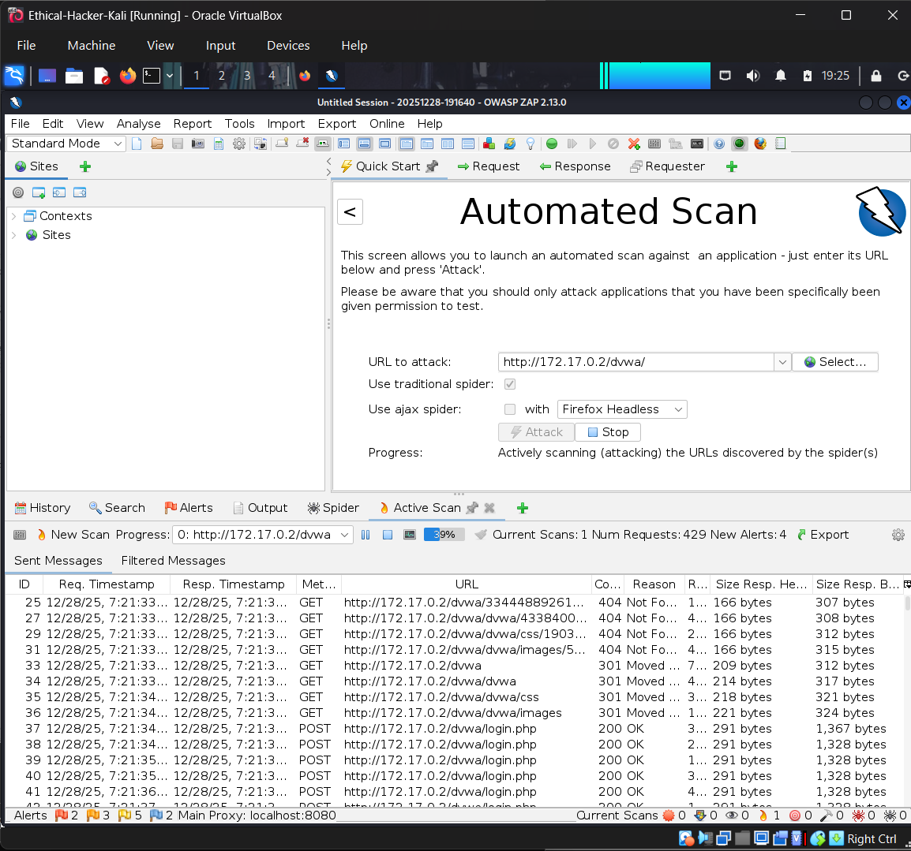
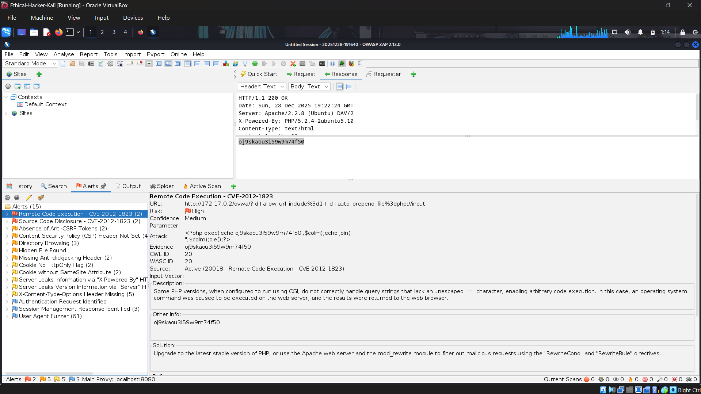
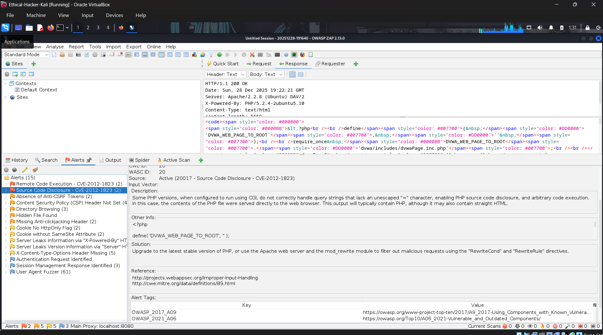
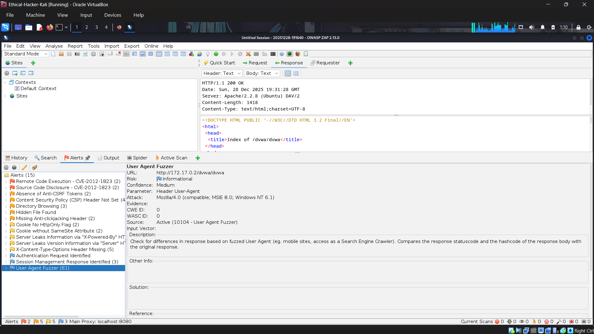

# Web Application Vulnerability Scanning with OWASP ZAP

## 1. Objective
The main goal of this lab was to conduct a Dynamic Application Security Testing (DAST) scan against a vulnerable target (Damn Vulnerable Web Application - DVWA) to identify security flaws. I utilized **OWASP ZAP (Zed Attack Proxy)** to perform an automated scan of the **DVWA (Damn Vulnerable Web Application)** to find issues such as Remote Code Execution (RCE) and Information Disclosure.

## 2. Tools & Environment
* **Scanner:** OWASP ZAP v2.13.0
* **Target:** DVWA (Damn Vulnerable Web Application) running on `172.17.0.2`
* **Platform:** Kali Linux

## 3. Workflow

### Step 1: Target Preparation
I first logged into the vulnerable web application (DVWA) by navigating to the target login page and authenticating using default credentials (`admin` / `password`). Ensuring the scanner has a valid session is crucial for reaching vulnerabilities behind login screens.

### Step 2: Configuring the Automated Scan
To start with the scanning tool, I launched OWASP ZAP and selected the **Automated Scan** mode. I then configured the target URL to `http://172.17.0.2/dvwa/` and initiated the attack by clicking the attack button. This process involves two phases:
1.  **Spidering:** Crawling the application to map out all available links and forms.
2.  **Active Scanning:** Sending malicious payloads to the discovered inputs to trigger vulnerabilities.

## 4. Findings & Analysis

Several critical vulnerabilities were identified through the scan. Below are the details of a few of the discoveries, including the most severe ones.

### Finding 1: Remote Code Execution (CVE-2012-1823)
* **Severity:** 🚨 High
* **Description:** ZAP detected that the PHP version running on the server is vulnerable to CGI query string parameter injection. This allows an attacker to execute arbitrary code on the server.
* **Evidence:** The scanner successfully injected a payload that executed a system command.

### Finding 2: Source Code Disclosure
* **Severity:** ⚠️ Medium
* **Description:** This finding indicates that the application is configured in a way that allows the source code of PHP files to be viewed by the client. This happens when the web server does not properly parse PHP files (for example, missing MIME types or misconfigured CGI).
* **Impact:** When exploited, attackers can read logic, database credentials, or API keys hardcoded in the source code.

### Finding 3: User Agent Fuzzing (Information)
* **Severity:** ℹ️ Informational
* **Description:** ZAP's fuzzer tested various User-Agent strings to see if the server responds differently to each request (for example, serving different content to mobile devices vs. desktops). This is not a direct vulnerability, but inconsistent responses can sometimes be abused by bad actors of threat.

## 5. Remediation Strategy
To secure this application, the following steps are recommended:
1.  **Proper Patch Management:** It is recommended to upgrade the PHP version immediately to fix the CVE-2012-1823 RCE vulnerability.
2.  **Proper Server Configuration:** This vulnerability can be remediated by disabling directory browsing and ensuring the web server is properly configured to parse PHP files correctly to prevent source code disclosure.
3.  **Input Validation:** Remediation can be achieved by sanitizing user input implementing strict allow-listing for all user inputs.

## 6. Conclusion
There are numerous automated tools that are incredibly powerful for quickly mapping the attack surface of a web application and OWASP ZAP is one of these tools. However, findings like "Source Code Disclosure" often require manual verification to confirm the impact as these tools can raise false positive and false negative alarms. This lab aimed to emphasize the importance of regular DAST scanning in the CI/CD pipeline.

